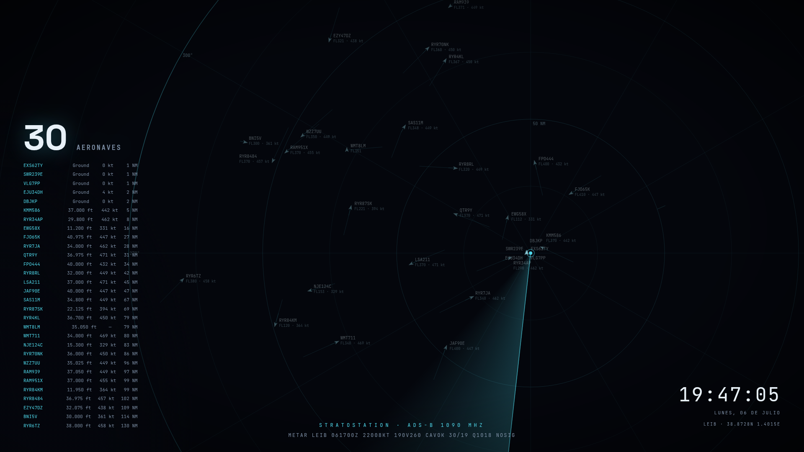

# ADS-B Radar Screensaver

Salvapantallas a pantalla completa estilo control de tráfico aéreo que muestra **tráfico aéreo
real en vivo** recibido por tu propia estación ADS-B — con barrido giratorio, estelas de posición,
etiquetas sin solapes, METAR en directo que se teclea solo como un teletipo, y números que ruedan
como una caja registradora.



**Demo en vivo (tráfico real sobre Ibiza, ahora mismo):**
https://strato88.duckdns.org/status/radar.html

[English version →](README.md)

## Qué necesitas

- Un receptor ADS-B con **readsb** o **dump1090-fa** (cualquier montaje de Raspberry Pi + RTL-SDR
  sirve — si alimentas FlightRadar24/FlightAware/ADSBx casi seguro que ya lo tienes).
  El único requisito es el fichero estándar `aircraft.json` que escriben esos decodificadores.
- Python 3 (solo librería estándar, sin paquetes pip).
- Un Mac o PC con Windows para el salvapantallas en sí.

## Puesta en marcha

```bash
git clone https://github.com/strato88/stratostation-radar-screensaver.git
cd stratostation-radar-screensaver
```

1. **Configura el radar** — edita el bloque `CONFIG` al inicio del `<script>` de
   [radar.html](radar.html): latitud/longitud de tu receptor, alcance, etiqueta de estación,
   aeropuerto del METAR, idioma, velocidades de animación. Todo está comentado.

2. **Configura el servidor** — los valores por defecto funcionan con un readsb estándar.
   Se pueden cambiar con variables de entorno:

   | Variable | Por defecto | Función |
   |---|---|---|
   | `RADAR_PORT` | `8095` | puerto HTTP |
   | `RADAR_AIRCRAFT_JSON` | `/run/readsb/aircraft.json` | salida del decodificador (para dump1090-fa: `/run/dump1090-fa/aircraft.json`) |
   | `RADAR_METAR_STATION` | `LEIB` | código ICAO del METAR del pie (cadena vacía lo desactiva) |

3. **Arráncalo** en la máquina que recibe ADS-B:

   ```bash
   python3 server.py
   ```

   Abre `http://<host>:8095/radar.html` en un navegador para comprobar que funciona.
   Para dejarlo permanente, mira [examples/adsb-radar.service](examples/adsb-radar.service).

4. **(Opcional) publícalo** a través de tu proxy inverso / DNS dinámico si quieres que el
   salvapantallas funcione fuera de tu LAN. Los dos endpoints sirven datos públicos (las
   aeronaves emiten su posición en abierto; los METAR son públicos), pero revisa lo que expones
   como con cualquier servicio.

## Instalar el salvapantallas

### macOS

1. Descarga [WebViewScreenSaver](https://github.com/liquidx/webviewscreensaver/releases)
   (gratuito, código abierto) y haz doble clic en `WebViewScreenSaver.saver` para instalarlo.
   Si Gatekeeper protesta, autorízalo en **Ajustes del Sistema → Privacidad y Seguridad**.
2. **Ajustes del Sistema → Fondo de pantalla → Salvapantallas** → selecciona
   **WebViewScreenSaver** → **Opciones**:
   - Desmarca *Fetch URLs Remotely*.
   - En **Addresses**, borra la URL de ejemplo y añade la tuya:
     `http://<host>:8095/radar.html` (o tu URL pública HTTPS).
   - Pon en *Seconds* un valor grande (p. ej. `999999`) — la página ya refresca sola sus datos.
3. Varias pantallas: activa **"Mostrar en todas las pantallas"** junto a la vista previa.

### Windows

1. Instala [Lively Wallpaper](https://rocksdanister.github.io/lively/) (gratuito, código
   abierto) — usa la versión **installer**, no la de Microsoft Store, para que el salvapantallas
   funcione sin tener la app abierta.
2. En Lively: **+** → pestaña **Webpage/URL** → pega tu URL del radar.
3. Ajustes de Lively (engranaje) → pestaña **Screensaver** → activa usar el wallpaper actual
   como salvapantallas. Opcionalmente instala el `.scr` de Lively desde esa misma pestaña para
   elegirlo desde el diálogo nativo de salvapantallas de Windows.

## Cómo funciona

- `server.py` (~100 líneas, solo stdlib) sirve la página estática, reenvía el `aircraft.json`
  de tu decodificador y cachea 5 minutos el METAR de
  [aviationweather.gov](https://aviationweather.gov/data/api/).
- `radar.html` es una única página autocontenida: un `<canvas>` pinta anillos, rumbos, barrido,
  estelas y blips a 60 fps; los datos se refrescan cada 10 s. Las etiquetas se colocan con un
  pequeño resolutor de colisiones que va probando posiciones en espiral hasta encontrar hueco,
  para que las rampas de aeropuerto densas sigan siendo legibles. Las aeronaves en tierra
  (o con altitud barométrica negativa) se muestran como `Ground`.
- Las fuentes ([Space Grotesk](https://github.com/floriankarsten/space-grotesk),
  [JetBrains Mono](https://github.com/JetBrains/JetBrainsMono)) van incluidas en `vendor/`
  bajo licencia SIL Open Font License, así la página funciona sin peticiones externas.

## Licencia

[MIT](LICENSE). Fuentes bajo [SIL OFL 1.1](vendor/FONT-LICENSES.md).
