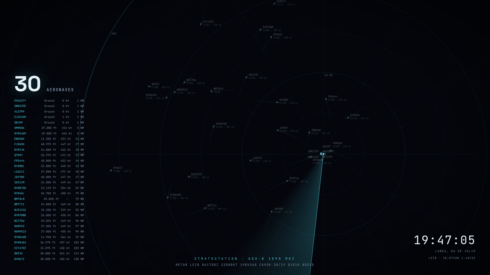

# ADS-B Radar Screensaver

A full-screen, ATC-style radar screensaver showing **real live air traffic** received by your own
ADS-B station — with a rotating sweep, position trails, non-overlapping labels, live METAR that
types itself out like a teletype, and numbers that roll like a cash register.



**Live demo (real traffic over Ibiza, right now):**
https://strato88.duckdns.org/status/radar.html
· with coastline overlay: https://strato88.duckdns.org/status/radar-terrain.html

[Versión en español →](README.es.md)

## What you need

- An ADS-B receiver feeding **readsb** or **dump1090-fa** (any Raspberry Pi + RTL-SDR dongle setup
  works — if you feed FlightRadar24/FlightAware/ADSBx you almost certainly already have this).
  The only requirement is the standard `aircraft.json` file these decoders write.
- Python 3 (standard library only, no pip packages).
- A Mac or Windows PC for the screensaver itself.

## Quick start

```bash
git clone https://github.com/strato88/stratostation-radar-screensaver.git
cd stratostation-radar-screensaver
```

1. **Configure the radar** — edit the `CONFIG` block at the top of the `<script>` in
   [radar.html](radar.html): your receiver's latitude/longitude, range, station label,
   METAR airport, locale, animation speeds. Everything is commented.

2. **Configure the server** — defaults work for a stock readsb install. Override with
   environment variables if needed:

   | Variable | Default | Purpose |
   |---|---|---|
   | `RADAR_PORT` | `8095` | HTTP port |
   | `RADAR_AIRCRAFT_JSON` | `/run/readsb/aircraft.json` | decoder output (use `/run/dump1090-fa/aircraft.json` for dump1090-fa) |
   | `RADAR_METAR_STATION` | `LEIB` | ICAO code for the footer METAR (empty string disables it) |

3. **Run it** on the machine that receives ADS-B:

   ```bash
   python3 server.py
   ```

   Open `http://<host>:8095/radar.html` in a browser to check it works.
   To run it permanently, see [examples/adsb-radar.service](examples/adsb-radar.service).

4. **(Optional) expose it through your reverse proxy / dynamic DNS** if you want the screensaver
   to work outside your LAN. Note the two API endpoints are public data (aircraft broadcast
   their position in the clear; METARs are public), but review what you expose as with any service.

## Install the screensaver

### macOS — quick install (prebuilt, no setup)

Download **[ADSB-Radar-Screensaver-macOS.zip](https://github.com/strato88/stratostation-radar-screensaver/releases/download/macos-v1.0/ADSB-Radar-Screensaver-macOS.zip)**,
unzip it and double-click `ADSB Radar.saver` — macOS will offer to install it. It comes preloaded
with the live Ibiza feed, and you can point it at your own receiver from **Options**. Since it is
not notarized by Apple, if Gatekeeper blocks it go to **System Settings → Privacy & Security**
and click **Open Anyway**.

### macOS — manual setup (generic loader)

1. Download [WebViewScreenSaver](https://github.com/liquidx/webviewscreensaver/releases)
   (free, open source) and double-click `WebViewScreenSaver.saver` to install.
   If Gatekeeper complains, allow it under **System Settings → Privacy & Security**.
2. **System Settings → Wallpaper → Screen Saver** → select **WebViewScreenSaver** → **Options**:
   - Untick *Fetch URLs Remotely*.
   - In **Addresses**, remove the sample URL and add yours:
     `http://<host>:8095/radar.html` (or your public HTTPS URL).
   - Set *Seconds* to a large value (e.g. `999999`) — the page refreshes its own data.
3. Multiple displays: enable **"Show on all displays"** next to the preview.

### Windows

1. Install [Lively Wallpaper](https://rocksdanister.github.io/lively/) (free, open source) —
   use the **installer** version, not the Microsoft Store one, so the screensaver runs without
   the app open.
2. In Lively: **+** → **Webpage/URL** tab → paste your radar URL.
3. Lively settings (gear) → **Screensaver** tab → enable using the current wallpaper as
   screensaver. Optionally install Lively's `.scr` from the same tab to pick it from the native
   Windows screensaver dialog.

## Minimal view (no aircraft list, no footer text)

[radar-minimal.html](radar-minimal.html) is a stripped-down alternative to `radar.html`: same live
radar — rings, sweep, trails, blip labels, clock — but without the aircraft list/counter panel
(bottom-left) and without the footer text (bottom-center kicker + METAR line). Only the clock,
date and station label remain in the corner. Same `CONFIG` block, same server endpoints.

It also bundles the coastline overlay from the terrain view below (`CONFIG.coastUrl`, on by default
using the bundled Ibiza example) — set `coastUrl: null` in its `CONFIG` block to turn it off.

## Terrain view (optional coastline overlay)

[radar-terrain.html](radar-terrain.html) is an alternative to `radar.html` — same live radar, same data,
but with a coastline drawn under the rings so aircraft positions have a geographic reference, not just a
bearing and a distance in NM.

It reads `CONFIG.coastUrl` (default `examples/coast-example.json`, a JSON array of `[[lon, lat], ...]`
chains — one array per coastline/island). The bundled example covers Ibiza/Formentera, the rest of the
Balearic Islands and the Valencia/Alicante mainland coast, which is enough for the default 150 NM range.
Set `coastUrl: null` in the `CONFIG` block to turn the overlay off, or point it at your own region.

To build coastline data for your own station: query [Overpass API](https://overpass-api.de/api/interpreter)
for `way["natural"="coastline"]` inside a bounding box around your receiver (`out geom;` returns each way's
points inline), stitch the returned segments into continuous chains by matching shared endpoints — OSM
splits coastlines into arbitrary pieces at tile boundaries — then simplify. Plain Douglas-Peucker keeps
narrow spikes (piers, breakwaters, marina jetties) because they have high perpendicular deviation; use
**Visvalingam-Whyatt** instead (drops the vertex with the smallest triangle area each step, so thin spikes
go first) and finish with one pass of Chaikin corner-cutting to round the remaining joints. That's the
whole pipeline used to generate the bundled example — plain Python stdlib (`urllib`, `heapq`), no extra
dependencies.

## Continuous deployment (optional)

[.github/workflows/deploy.yml](.github/workflows/deploy.yml) updates your production clone whenever
`main` changes, using a **self-hosted GitHub Actions runner** installed on your own station server —
nothing runs on GitHub's cloud runners, and you don't need to open any inbound port (the runner
connects out to GitHub, not the other way around).

It's normal for a production clone to carry permanent local customizations — a hand-edited `CONFIG`
block, extra pages, whatever you've bolted on — that will never match `main`. The workflow fast-forwards
when it can, does a real merge when `main`'s changes and your customizations don't touch the same
lines, and only when they genuinely conflict does it back out cleanly (it never leaves conflict
markers live in a file the server is serving) and fail the job so you're notified. Resolve those by
hand over SSH — same idea as any git conflict: `cd $DEPLOY_PATH`, `git status`, fix the marked files,
`git add`, `git commit`.

1. On the server, go to this repo's **Settings → Actions → Runners → New self-hosted runner** and
   follow GitHub's own download/configure commands (pick the package matching your server's
   architecture — `uname -m`: `aarch64` → arm64, `armv7l`/`armv6l` → arm, `x86_64` → x64). Install it
   as a service so it survives reboots:
   ```bash
   sudo ./svc.sh install
   sudo ./svc.sh start
   ```
2. Add a repository **variable** (Settings → Secrets and variables → Actions → Variables) named
   `DEPLOY_PATH` set to the absolute path of your production clone on that server, e.g.
   `/home/pi/stratostation-radar-screensaver`. If your production files aren't a git clone yet, turn
   them into one first: `git init`, `git add -A && git commit`, `git remote add origin <this repo>`,
   `git fetch origin`, then `git merge origin/main --allow-unrelated-histories` and resolve conflicts
   in your customized files the same way (`git checkout --ours <file>` keeps your production version
   untouched for that one-time merge).
3. If you installed [examples/adsb-radar.service](examples/adsb-radar.service), the workflow tries
   to `sudo systemctl restart adsb-radar.service` after every pull (harmless no-op if you don't use
   it, and non-fatal if it fails — the runner user needs passwordless `sudo` for that one command
   if you want the restart to actually happen).

Without a registered runner, the workflow simply stays queued and does nothing — safe to merge
even if you haven't set this up yet.

## How it works

- `server.py` (~100 lines, stdlib only) serves the static page, relays your decoder's
  `aircraft.json`, and caches the METAR from
  [aviationweather.gov](https://aviationweather.gov/data/api/) for 5 minutes.
- `radar.html` is a single self-contained page: a `<canvas>` renders rings, bearings, sweep,
  trails and blips at 60 fps; data refreshes every 10 s. Blip labels get placed by a small
  collision solver that spirals outwards until it finds free space, so dense airport ramps
  stay readable. Aircraft on the ground (or reporting negative baro altitude) show as `Ground`.
- Fonts ([Space Grotesk](https://github.com/floriankarsten/space-grotesk),
  [JetBrains Mono](https://github.com/JetBrains/JetBrainsMono)) are bundled in `vendor/` under
  the SIL Open Font License so the page works with no external requests.

## License

[MIT](LICENSE). Fonts under the [SIL OFL 1.1](vendor/FONT-LICENSES.md).
